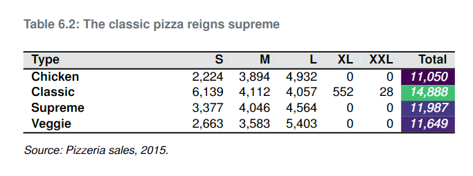

## Objectives {.build}

In this session you will learn to:

>-   Create summary tables in R
>-   Convert R tables into a LaTeX format with the **knitr** and **kableExtra** packages
>-   Save LaTeX tables directly into Overleaf

# Getting started with R tables

## Let's load our packages

```{r set-up, include = FALSE, echo = TRUE, warning = FALSE}
library(tidyverse)
library(knitr)
library(kableExtra)
library(gt)
```

## The pizzaplace dataset

Dataset contains 2015 sales data for a pizzeria, where each row is a pizza sold.

```{r dataset, echo = TRUE}
pizzaplace |>
  str(vec.len = 3) # Just show first 3 values
```

## Summary tables {.smaller}

To get the number of pizzas sold of different types, we can use the table function.

```{r summary_n}
freq_table <- table(pizzaplace$type)

print(freq_table)
```

If we want relative proportions, not a frequency table, we can use prop.table().

```{r summary_prop}
prop.table(freq_table)
```

## Two-way frequency tables

We can also make two-way frequency tables in base R.

```{r two_way}
two_way_table <- table(pizzaplace$type, pizzaplace$size) |>
  # We convert the table to a data frame as relocate
  # does not work on a table object
  as.data.frame.matrix() |>
  relocate(c(S, M), .before = L)

print(two_way_table)
```

No way! Vegetarians can't get big pizzas. This is an outrage.

---

We can get more fancy using other packages. 

>- Use `tabyl()` from **janitor** to produce and "adorn" tabulations and cross-tabulations 
>- Use `get_summary_stats()` from **rstatix** to easily generate data frames of numeric summary statistics for multiple columns and/or groups 
>- Use `summarise()` and `count()` from **dplyr** for more complex statistics, tidy data frame outputs, or preparing data for ggplot() 
>- Use `tbl_summary()` from **gtsummary** to produce detailed publication-ready tables

# From R to LaTeX | How to get your tables report-ready {.build}

## The **kable** package

The **knitr** and **kableExtra** packages allows you to produce report-ready tables. 

Let's begin by piping our table into the `kable()` function.  

```{r basic-kable, echo = TRUE}
two_way_table |>
  kable() |>
  kable_styling(full_width = T)
```

We can see that it already looks visually better.

---

We can also add arguments within the the `kable()` call 

```{r pretty-kable, echo = T, warning = F}
pretty_table <-
  two_way_table %>%
  # Capitalising the pizza types (which are saved as labels)
  mutate(Type = labels(.)[[1]] |> str_to_sentence(), .before = S) |>
  # This line removes the original labels
  unnest() |>
  # I've added totals for each type, too, using the <b>janitor<\b> package
  janitor::adorn_totals(where = "col")
```

---

```{r, echo = F}
pretty_table |>
  kable(
    format.args = list(big.mark = ","),
    caption = "Size doesn't really matter"
  ) |>
  footnote(
    general_title = "",
    general = "Source: Pizzeria sales, 2015."
  ) |>
  kable_styling("striped", full_width = T)
```

## Getting jazzy

We can even format the table columns and add small plots.

```{r compute-sales, include = F, echo = F, warnings = F}
price_list <- pizzaplace |>
  mutate(month = lubridate::month(date)) |>
  group_by(month, type) |>
  summarise(total_sales = sum(price)) %>%
  split(.$type) %>%
  map(~ .x |> pull(total_sales))
```

```{r pressure}
final_table <- pretty_table |>
  cbind(`Sales over time` = "") |>
  kable(booktabs = T) |>
  kable_styling(full_width = T) |>
  # Make the first column bold
  column_spec(1, bold = T) |>
  # Add a gradient to the totals column, 
  # proportionate to background fill
  column_spec(7,
    color = "white",
    italic = T,
    background = spec_color(pretty_table$Total, end = 0.7)
  ) |>
  # Add inline plots to the final column
  column_spec(8, image = spec_plot(price_list))
```

---
Here is what the final product looks like

```{r echo = F}
final_table
```

```{r include = F, echo = F}
# This code creates the table above, but in LaTeX format (the above is HTML, as the isoslides presentations doesn't support LaTex tables).

final_table <- pretty_table |>
  kable(
    booktabs = T,
    format = "latex",
    format.args = list(big.mark = ","),
    caption = "The classic pizza reigns supreme",
  ) |>
  # Make the first column bold
  column_spec(1, bold = T) |>
  # Add a gradient to the totals column, 
  # proportionate to background fill
  column_spec(7,
    color = "white",
    italic = T,
    background = spec_color(pretty_table$Total, end = 0.7)
  ) |> 
  row_spec(0, bold = T, background = grattantheme::grattan_grey_alpha) |> 
  footnote(
    general_title = "",
    general = "Source: Pizzeria sales, 2015."
  )
```

# Exporting to Latex | How to get your pretty table into LaTeX

## Exporting

Use `writeLines` to save a `.tex` file with your Tex code. I save it straight to Overleaf.

```{r pizza-latex-table}
final_table |> 
  writeLines(paste0("C:/Users/parkinsonn/Dropbox (Grattan Institute)",
                  "/Apps/Overleaf/",
                  "tables-at-grattan/tables/tbl_pizza_sales.tex"))
```

## Add the table to your report
Use the `\input{tables\your_table.text}` in Overleaf to call your table. 

You may wish to make the table fit a full column by changing the table environment to `\begin{tabularx}` and adding `{\linewidth}`.

You may need to adjust column widths. This can be done back in R. To make the first column 2cm wide, use `column_spec(1, width = "2cm")`.

## And voilà


